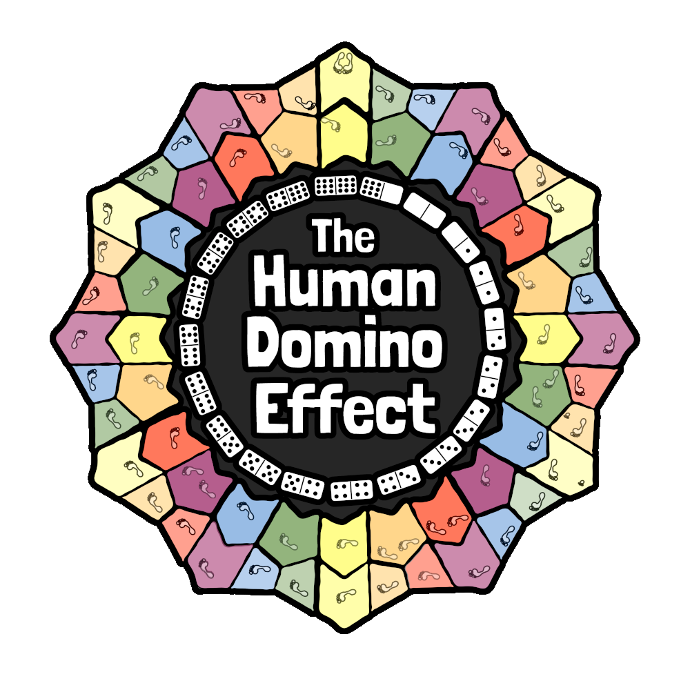

# 

### Overview

Welcome to the official GitHub repository for the Human Domino Effect (HDE) Game! This repository contains the HDE codebase and additional documentation for project developers and product owners. For more information on the game, visit the Human Domino Effect homepage at https://thehumandominoeffect.com.

---

### Major Game Features

-   Menu screens with parallax background scrolling
-	UI buttons with interactive animations
-	Three game levels
	-   Character Creation
		-   Skippable dialogue
		-   Elcitrap capturing and selection
		-   Player customization
	-   Pond Choices
		-	Responsive ring resizing
	-   Domino Game
		-	Multiplayer lobbies
		-	Player scoring
		-	Valid placement indicators
		-	CPU logic for lobbies with less than six players
		-	Stalemate detection
		-	Automatic next round initiation

---

### Quick Start

#### Requirements

-	Godot Engine
	-	Download the current stable release of Godot Engine from [Godot's official site](https://godotengine.org/download/)

#### First Run

1.  Clone the GitHub repository locally
2.  Open Godot and select `Import Project`
3.	Select the project directory from the file system
3.  Once the project is imported, press the play button in the top right corner

---

### Notes for Developers

#### Contributing to the Project

In order to maintain a stable build on the `main` branch, changes can't be directly pushed to it. Instead, feature branches must be created and merged into `main` via pull requests. This allows appropriate testing and code review to take place before merging. 

#### Issue Tracking

GitHub Issues are used to track bugs, feature requests, and any other kind of development tasks. This keeps all relevant repository documentation in one place, ensuring availability of information for all future teams.

#### Workflows

A series of GitHub Actions define several workflows that run on various triggers. For example, whenever a pull request is created, the automated test suite is run to ensure that no destructive changes were made. These actions can be customized and configured in many useful ways to enhance productivity.
